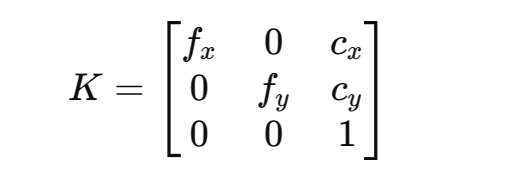
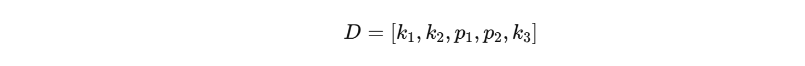

## 一、相机内参矩阵（`camera_matrix`）

### 定义：
相机内参矩阵描述的是从 **三维相机坐标系** 到 **二维图像平面** 的投影关系，形式如下：



- **f_x, f_y**：分别是 x 和 y 方向的焦距，单位通常为像素（由物理焦距 * 像素密度得来）
- **c_x, c_y**：主点坐标（即图像的光心，通常接近图像中心）

### 示例（你代码里的）：
```python
camera_matrix = np.array([
    [5859.44013, 0.0, 312.206258], 
    [0.0, 6838.49170, 241.970339], 
    [0.0, 0.0, 1.0]
])
```

含义是：
- 图像的焦距在 x 方向是约 5859 像素，在 y 方向是 6838 像素
- 图像中心在 (312.2, 241.9) 像素位置

---

## 二、畸变参数（`dist_coeffs`）

### 定义：
真实镜头成像过程中由于镜片形变等原因，图像会产生畸变，主要有以下几种类型：

1. **径向畸变（Radial Distortion）**：镜头边缘会出现“桶形”或“枕形”变形
2. **切向畸变（Tangential Distortion）**：由于镜头和图像平面不完全平行，导致图像发生偏移

OpenCV 默认使用 5 个参数：



- **k1, k2, k3**：径向畸变系数
- **p1, p2**：切向畸变系数

也可以使用更高阶的参数（如 `k4, k5, k6`）

### 示例（你代码里的）：
```python
dist_coeffs = np.array([[
    -7.30909746,     # k1
    -436.531650,     # k2
    -0.0221391554,   # p1
    0.220096496,     # p2
    -1.66286367      # k3
]])
```

这个表示你相机的畸变程度较高（注意第二项 `k2` 的值是 -436，非常大，说明畸变很严重，可能有误？）。

---

## 三、校正原理（简述）

函数 `cv2.undistort()` 使用了你提供的 `camera_matrix` 和 `dist_coeffs` 来纠正原始图像的畸变，步骤大致如下：

1. **计算映射关系**（像素点如何从原图映射到畸变校正后的图像）
2. **插值重采样**，生成新图像

在你的代码中还用了：
```python
cv2.getOptimalNewCameraMatrix()
```
它会基于图像尺寸、畸变程度，计算一个 **新的内参矩阵**，用于更好地显示结果（避免黑边或裁切太多图像）。

---

## 四、可视化理解（推荐动手试试）

你可以试试用 `cv2.initUndistortRectifyMap` 和 `cv2.remap` 自己可视化一下像素点映射关系，这样对畸变理解会更直观。

---

如果你感兴趣，我可以再补充一下：
- 如何通过 `cv2.calibrateCamera` 得到这些参数
- 如何自己画出畸变示意图，理解径向和切向畸变的物理意义

